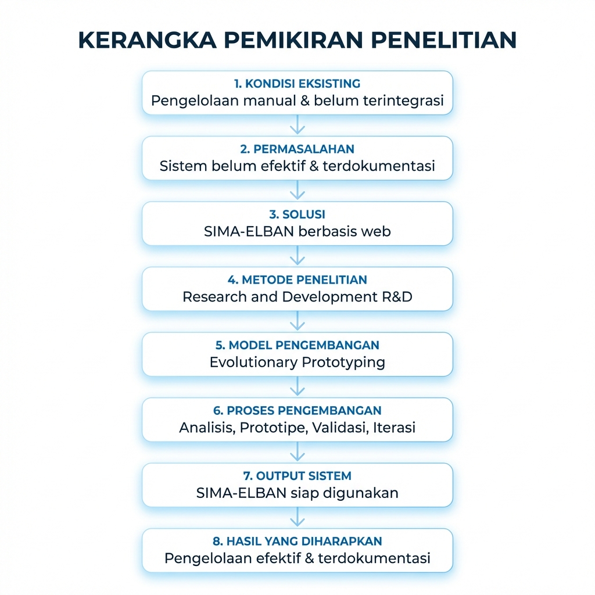
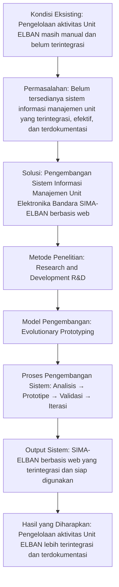

# BAB II: TINJAUAN PUSTAKA

## 2.1 Penelitian Terdahulu

Penelitian terdahulu digunakan sebagai bahan perbandingan untuk melihat posisi penelitian yang sedang dilakukan agar tidak ada kesamaan dengan karya ilmiah orang lain. Lewat tinjauan ini, penulis bisa menentukan fitur-fitur penting yang perlu dibuat pada sistem informasi manajemen unit elban. Berikut ini adalah tabel perbandingan antara beberapa penelitian terdahulu yang menjadi acuan dalam mengerjakan sistem SIMA-ELBAN.

| No | Nama Peneliti & Tahun | Judul Penelitian | Hasil Penelitian | Perbedaan dengan penelitian ini |
|---|---|---|---|---|
| 1 | Mokodompit dkk. (2024) | Sistem Informasi Pengelolaan Administrasi Organisasi Kemahasiswaan Berbasis Web di Universitas Negeri Gorontalo | Menghasilkan aplikasi SiOrmawa yang mengelola administrasi, keanggotaan, serta peminjaman fasilitas organisasi secara digital. | Perbedaan terletak pada objek penelitian yaitu administrasi kemahasiswaan, sedangkan penelitian ini berfokus pada manajemen operasional teknis bandara yang mengintegrasikan aset, personel, dan jadwal. |
| 2 | Nufusi dkk. (2023) | Rancang Bangun Sistem Informasi Monitoring Organisasi Mahasiswa Berbasis Web Menggunakan Framework CodeIgniter | Menghasilkan sistem SIMORA untuk monitoring kegiatan, pengajuan dana, dan proses verifikasi proposal secara bertahap. | Penelitian terdahulu fokus pada monitoring dana dan proposal kegiatan, sedangkan penelitian ini menekankan pada manajemen teknis lapangan dan pengaturan jadwal dinas (duty roster). |
| 3 | Syahputri dkk. (2023) | Perancangan Sistem Informasi Program Kerja Organisasi Kemahasiswaan Berbasis Web | Membangun sistem untuk digitalisasi pengajuan program kerja, proposal, serta laporan pertanggungjawaban kegiatan mahasiswa. | Penelitian terdahulu membahas administrasi program kerja, sedangkan penelitian ini mengkhususkan pada layanan teknis, pengelolaan dokumen arsip, dan sistem tiket pengaduan kerusakan. |
| 4 | Helinda dkk. (2024) | Desain Aplikasi Sistem Inventory pada Bandara Sultan Iskandar Muda | Menghasilkan desain aplikasi inventori berbasis web untuk memantau, mengontrol, dan mengatur aliran persediaan barang. | Penelitian ini fokus pada inventori stok barang umum, sedangkan penelitian penulis fokus pada manajemen teknis aset elektronika penerbangan beserta riwayat kinerjanya. |
| 5 | Parihady (2025) | Rancang Bangun Sistem Inspeksi dan Maintenance Ground Support Equipment pada PT Angkasa Aviasi Service | Membangun sistem digital untuk inspeksi dan pemeliharaan peralatan penunjang darat (Ground Support Equipment/GSE). | Penelitian terdahulu fokus pada peralatan GSE, sedangkan penelitian ini fokus pada peralatan Elektronika Bandara (Elban) dengan fitur integrasi personel dan jadwal. |
| 6 | Sari & Devitra (2017) | Analisis dan Perancangan Sistem Informasi Manajemen Aset pada Kantor BMKG Provinsi Jambi | Merancang prototipe sistem untuk mengoptimalkan pengelolaan aset dari perencanaan, pengadaan, hingga penghapusan yang sebelumnya manual. | Penelitian terdahulu fokus pada manajemen administratif aset kantor, sedangkan penelitian ini mengelola aset teknis vital penerbangan dengan fitur monitoring kinerja alat dan integrasi petugas teknis. |

## 2.2 Landasan Teori

Landasan teori berisi uraian mengenai konsep-konsep dasar dan teori yang mendukung pelaksanaan penelitian sistem informasi manajemen di lingkungan unit kerja. Berikut ini adalah uraian mengenai teori-teori serta teknologi yang digunakan sebagai pilar utama dalam membangun sistem informasi manajemen tersebut.

### 2.2.1 Sistem Informasi

Sistem informasi adalah kumpulan bagian-bagian yang saling terhubung untuk mencari, mengolah, menyimpan, dan membagi informasi secara teratur. Dalam organisasi seperti bandara, sistem ini sangat berguna untuk membantu pimpinan dalam mengambil keputusan yang tepat di setiap bagian kerja. Ketersediaan data yang cepat dan benar merupakan hal yang sangat penting agar kegiatan rutin di unit kerja dapat berjalan tanpa hambatan. Sebuah sistem yang bagus harus bisa menghubungkan kebutuhan petugas di lapangan dengan kebutuhan laporan milik pimpinan secara merata. Pengolahan data yang berjumlah banyak akan menjadi lebih ringan apabila sistem dirancang dengan susunan data yang rapi dan teliti. Selain itu, kebenaran isi data harus selalu dijaga agar informasi yang keluar benar-benar sesuai dengan apa yang terjadi di lapangan. Penggunaan sistem informasi yang tepat akan mengubah cara orang bekerja dari yang tadinya sulit menjadi jauh lebih lancar dan bersemangat.

### 2.2.2 Manajemen Inventaris

Manajemen inventaris adalah proses pengaturan barang-barang atau peralatan kerja agar barang tersebut selalu siap saat akan digunakan. Tugas pokok dalam bagian ini adalah memantau kondisi barang, sejarah pemeliharaan, serta tempat penyimpanan barang secara terus-menerus. Tanpa adanya aturan yang jelas, sebuah organisasi akan bingung saat ingin membeli barang baru atau memperbaiki alat yang sudah rusak. Pendataan aset harus dilakukan secara rutin agar masa pakai dari peralatan tersebut bisa bertahan dalam waktu yang lebih lama. Penggunaan bantuan teknologi dalam mendata barang terbukti bisa mengurangi kemungkinan adanya barang yang hilang karena kesalahan tulis oleh petugas. Selain itu, manajemen barang yang baik juga membantu pimpinan dalam mengatur uang perbaikan agar tidak terbuang untuk hal yang tidak perlu. Hasil dari pengelolaan barang yang rapi akan menjamin semua kegiatan di unit kerja bisa berlangsung tanpa ada gangguan alat yang macet.

### 2.2.3 Quick Response Code (QR Code)

Teknologi Quick Response Code adalah jenis kode batang dua dimensi yang sanggup menyimpan informasi dalam jumlah yang sangat banyak. Kode ini bisa dibaca oleh kamera ponsel dengan sangat cepat walaupun cahaya di sekitar lokasi kerja tidak terlalu terang. Dalam dunia industri, kode ini sangat sering dipakai untuk mengenali barang secara instan hanya dengan sekali pindai saja. Data yang ada di dalam kode tersebut biasanya berupa tulisan rahasia yang akan membawa petugas ke halaman info detail suatu alat. Pemasangan kode unik ini pada peralatan bandara akan sangat mempermudah teknisi saat ingin melihat sejarah perbaikan alat di lapangan. Selain itu, pembuatan stiker kode ini bisa dilakukan dengan biaya yang sangat murah namun manfaatnya sangat besar bagi kelancaran pekerjaan. Ketahanan kode ini terhadap kotoran atau goresan ringan membuatnya sangat pas untuk ditempelkan pada mesin atau alat elektronika lainnya.

### 2.2.4 Web-based Application

Aplikasi berbasis web merupakan perangkat lunak yang dapat dijalankan di berbagai perangkat hanya dengan menggunakan bantuan aplikasi peramban atau web browser saja. Keunggulan utama dari teknologi ini adalah kemudahan akses bagi pengguna karena tidak memerlukan proses instalasi yang rumit pada setiap perangkat keras. Pengembang sistem dapat melakukan pembaruan fitur secara terpusat pada server sehingga seluruh pengguna akan mendapatkan versi terbaru secara serentak. Kemampuan aplikasi web untuk menyesuaikan tampilannya pada berbagai ukuran layar menjadikan aplikasi ini sangat fleksibel untuk digunakan oleh teknisi bandara. Interaksi antara pengguna dengan server dapat terjadi secara langsung dengan kecepatan akses data yang sangat tinggi jika didukung jaringan internet yang stabil. Platform web juga memungkinkan terjadinya kolaborasi data di antara banyak pengguna dalam waktu yang bersamaan tanpa terjadi konflik data. Penggunaan teknologi web modern saat ini telah mampu menyajikan performa yang setara dengan aplikasi desktop namun dengan kemudahan penggunaan yang jauh lebih baik.

### 2.2.5 Database Real-time Supabase

Supabase adalah layanan penyimpanan data yang memiliki fitur pembaruan data secara langsung untuk mendukung kebutuhan aplikasi masa kini. Platform ini dibangun dengan teknologi yang sangat kuat dan sudah teruji dalam mengelola ribuan data secara aman serta merata. Fitur utama yang sangat menolong pembuat program adalah sistem keamanan masuk pengguna yang sudah tersedia di dalam aplikasinya. Data yang disimpan oleh Supabase dapat dibuka melalui berbagai alat dengan jaminan keamanan yang sangat ketat dan terjaga. Kemampuan pengolahan data secara langsung membuat setiap perubahan status alat di lapangan bisa segera dilihat oleh pimpinan di kantor. Penggunaan layanan ini juga membebaskan pimpinan unit dari tugas berat mengurus komputer server sendiri yang harganya sangat mahal. Dengan Supabase, semua dokumen penting dan catatan harian teknisi tersimpan aman dalam lemari data digital yang siap dibuka kapan saja.

### 2.2.6 Version Control GitHub

GitHub adalah platform kolaborasi yang digunakan untuk mengelola kode sumber aplikasi menggunakan sistem kontrol versi yang sangat canggih dan tertata. Platform ini memungkinkan peneliti untuk mencatat setiap perubahan yang dilakukan pada aplikasi dari tahap awal hingga tahap aplikasi siap untuk dioperasikan. Adanya fitur riwayat perubahan kode memberikan jaminan bahwa data lama aplikasi tetap terjaga jika suatu saat terjadi kesalahan teknis yang gawat. Selain itu, platform ini juga menyediakan sarana untuk melacak bug atau permasalahan fitur yang muncul selama proses pengembangan sistem sedang berlangsung. Kolaborasi antar pengembang dapat berjalan dengan sangat harmonis karena sistem mampu menggabungkan berbagai revisi kode secara otomatis dan aman. Ketersediaan repositori daring juga memudahkan proses pencadangan data sistem di luar perangkat lokal milik pengembang aplikasi utama tersebut. Melalui GitHub, standar kualitas kode aplikasi SIMA-ELBAN dapat dijaga sesuai dengan praktik terbaik dalam dunia pengembangan perangkat lunak secara profesional.

### 2.2.7 Deployment Cloud Vercel

Vercel merupakan platform penyedia layanan hosting yang sangat optimal untuk menjalankan aplikasi web modern dengan performa akses yang sangat cepat. Layanan ini dirancang untuk melakukan proses pemindahan kode dari repositori ke server produksi secara otomatis setiap kali terdapat pembaruan data sistem. Dengan menggunakan layanan ini, sistem manajemen unit elban dapat diakses secara daring oleh seluruh personel selama mereka terhubung dengan jaringan internet yang stabil. Infrastruktur server yang canggih menjamin ketersediaan aplikasi tetap tinggi sehingga jarang sekali terjadi kendala akses karena server yang mengalami gangguan. Keandalan platform ini juga didukung oleh sistem keamanan jaringan yang mampu melindungi aplikasi dari berbagai jenis ancaman serangan dari dunia siber. Penggunaan deployment cloud menghilangkan keterbatasan fisik server lokal yang seringkali sulit untuk dirawat oleh personel teknis yang memiliki kesibukan tinggi. Hal ini memastikan bahwa pimpinan bandara dapat memantau data operasional kapan saja dan di mana saja tanpa ada batasan jarak yang menghalangi.

### 2.2.8 Google Antigravity (AI Assistant)

Google Antigravity adalah teknologi kecerdasan buatan atau AI yang berfungsi sebagai asisten cerdas dalam membantu proses perancangan dan penulisan baris kode aplikasi. Keberadaan teknologi ini membawa perubahan besar pada kecepatan pengembangan perangkat lunak dengan cara memberikan saran solusi terhadap kendala teknis yang dihadapi. AI ini mampu menganalisis struktur kode yang kompleks dan memberikan rekomendasi perbaikan agar aplikasi memiliki performa yang jauh lebih optimal dari sebelumnya. Selain membantu dalam hal teknis pemrograman, asisten cerdas ini juga dapat membantu dalam menyusun dokumentasi sistem agar lebih mudah untuk dipahami. Proses pencarian kesalahan atau debugging dapat diselesaikan dalam waktu yang jauh lebih singkat dibandingkan dengan melakukan pengecekan secara manual oleh pengembang. Kemampuan belajar dari AI ini memungkinkannya untuk terus memberikan saran yang semakin akurat seiring dengan bertambahnya data pengembangan yang telah dikerjakan. Penggunaan teknologi masa depan ini membuktikan bahwa pengembangan aplikasi SIMA-ELBAN telah mengadopsi standar teknologi yang sangat modern dan revolusioner.

## 2.3 Kerangka Pemikiran

Kerangka pemikiran menggambarkan alur logika penelitian yang menghubungkan masalah di lapangan dengan solusi teknologi yang ditawarkan secara sistematis. Bagian ini menjelaskan bagaimana proses transformasi digital di unit elban dilakukan mulai dari kondisi awal hingga hasil yang ingin dicapai. Berikut ini adalah flowchart dan penjelasan mengenai kerangka pemikiran dalam pengembangan sistem SIMA-ELBAN.

*Gambar 2.1: Kerangka Pemikiran Penelitian SIMA-ELBAN*

Penjelasan dari alur kerangka pemikiran di atas dapat dijabarkan dalam beberapa tahapan utama yang saling berkaitan satu sama lain. 1. Tahap pertama dimulai dengan melihat kondisi eksisting di unit elban di mana hampir seluruh pengelolaan aktivitas kerja masih dilakukan secara manual menggunakan kertas. Hal ini menyebabkan data operasional menjadi tidak terhubung dan sulit untuk dipantau secara langsung oleh pimpinan unit setiap saat. Kondisi yang belum terintegrasi ini menjadi beban tersendiri bagi para teknisi karena mereka harus menulis laporan yang sama secara berulang-ulang. Kurangnya pemanfaatan teknologi membuat proses administrasi unit terasa sangat lambat dibandingkan dengan tuntutan operasional bandara yang sangat tinggi. Selain itu, penyimpanan dokumen fisik yang tersebar di berbagai tempat berisiko besar mengakibatkan hilangnya data sejarah pemeliharaan alat yang sangat penting. Melalui pemahaman kondisi awal ini, penulis dapat melihat dengan jelas celah mana saja yang perlu diperbaiki menggunakan sistem digital. Peninjauan kondisi awal ini sangat membantu dalam menetapkan standar performa yang ingin dicapai melalui aplikasi baru nantinya.

2. Tahap kedua adalah menentukan permasalahan utama yaitu belum tersedianya sistem informasi manajemen unit yang benar-benar terintegrasi dan terdokumentasi dengan rapi. Masalah ini muncul karena cara kerja lama tidak lagi sanggup mengimbangi kompleksitas tugas teknisi elban yang semakin banyak setiap harinya. Tanpa adanya sistem yang handal, koordinasi antar personel menjadi terhambat dan sering terjadi kebingungan dalam pembagian tugas penugasan lapangan. Selain itu, ketiadaan pusat data yang terpadu membuat unit elban seringkali merasa kesulitan dan kelabakan saat harus menghadapi proses pemeriksaan audit. Kurangnya dokumentasi yang tertata juga membuat pencarian file dokumen teknis menjadi kegiatan yang sangat membuang waktu bagi para petugas. Permasalahan ini jika dibiarkan akan terus menurunkan kualitas pelayanan fasilitas keamanan penerbangan di bandar udara. Oleh karena itu, diperlukan sebuah terobosan baru untuk menyatukan semua administrasi tersebut dalam satu platform yang mudah dioperasikan. Penentuan masalah yang tepat akan menjamin bahwa fitur yang dibangun benar-benar menjadi solusi yang jitu bagi unit kerja.

3. Tahap ketiga adalah menawarkan solusi berupa pengembangan sistem informasi manajemen unit elektronika bandara yang diberi nama SIMA-ELBAN berbasis web. Pemulihan sistem ini dilakukan dengan memanfaatkan teknologi database cloud Supabase untuk menjamin penyimpanan data yang aman dan selalu sinkron. Layanan Vercel digunakan agar sistem dapat diakses secara luas melalui jaringan internet oleh seluruh personel di mana pun mereka berada. Dalam proses pembuatannya, asisten teknologi Google Antigravity digunakan untuk memastikan kode program aplikasi tersusun dengan standar yang sangat baik. GitHub juga dipakai sebagai wadah kolaborasi untuk menjaga sejarah perubahan sistem agar tetap terdokumentasi dengan rapi selama pengembangan. Solusi ini sengaja dirancang secara khusus untuk menjawab satu per satu masalah yang telah diidentifikasi pada bagian sebelumnya. Dengan teknologi ini, seluruh aktivitas unit elban yang semula bersifat manual akan beralih sepenuhnya ke dalam sistem digital yang cerdas. Langkah ini menjadi tonggak awal dari proses transformasi digital yang nyata di lingkungan kerja teknisi elban.

4. Tahap keempat adalah menghasilkan output sistem berupa aplikasi SIMA-ELBAN berbasis web yang sudah terintegrasi dan siap untuk langsung digunakan. Aplikasi ini telah dilengkapi dengan berbagai fitur penting seperti scan QR Code untuk identifikasi alat serta manajemen log performance secara elektronik. Selain itu, sistem ini menyediakan modul pengaturan jadwal personel atau duty roster dan pusat penyimpanan file dokumen teknis secara terpusat. Fitur pengaduan juga sudah tersedia agar unit lain dapat melaporkan kendala peralatan secara tertata dan langsung masuk ke database unit elban. Seluruh modul tersebut tidak berdiri sendiri melainkan saling terhubung sehingga data dari satu bagian bisa langsung digunakan oleh bagian yang lain. Output berupa aplikasi yang sudah jadi ini merupakan wujud nyata dari upaya modernisasi manajemen unit kerja di lingkungan kantor bandara. Produk akhir ini akan menjadi alat bantu utama bagi para teknisi dalam menjalankan tugas operasional mereka setiap hari. Ketersediaan aplikasi yang stabil akan memberikan rasa percaya diri bagi seluruh personel dalam menjalankan kewajibannya.

5. Tahap kelima adalah mencapai hasil yang diharapkan yaitu pengelolaan aktivitas unit elban menjadi jauh lebih terintegrasi dan terdokumentasi dengan sempurna. Dengan sistem yang baru, pencarian informasi mengenai riwayat perbaikan alat dapat dilakukan hanya dalam hitungan detik melalui pemindaian kode unik. Efisiensi kerja akan meningkat secara signifikan karena tidak ada lagi proses penulisan laporan manual yang panjang di atas kertas. Koordinasi antar personel juga akan semakin profesional berkat fitur pengaturan tugas dan jadwal yang sangat transparan bagi semua pihak. Kesiapan data untuk keperluan audit akan terjamin karena semua bukti dokumentasi kerja telah tersimpan rapi dan otomatis di dalam sistem pusat. Secara keseluruhan, transparansi dan akuntabilitas kinerja unit elban akan meningkat seiring dengan kemudahan akses informasi bagi para pimpinan. Hasil akhir ini pada akhirnya akan berkontribusi besar dalam menjaga standar keselamatan dan keamanan penerbangan di UPBU Karel Sadsuitubun. Keberhasilan pencapaian target ini akan menjadi bukti bahwa teknologi informasi sanggup membawa kemajuan besar bagi unit kerja.
