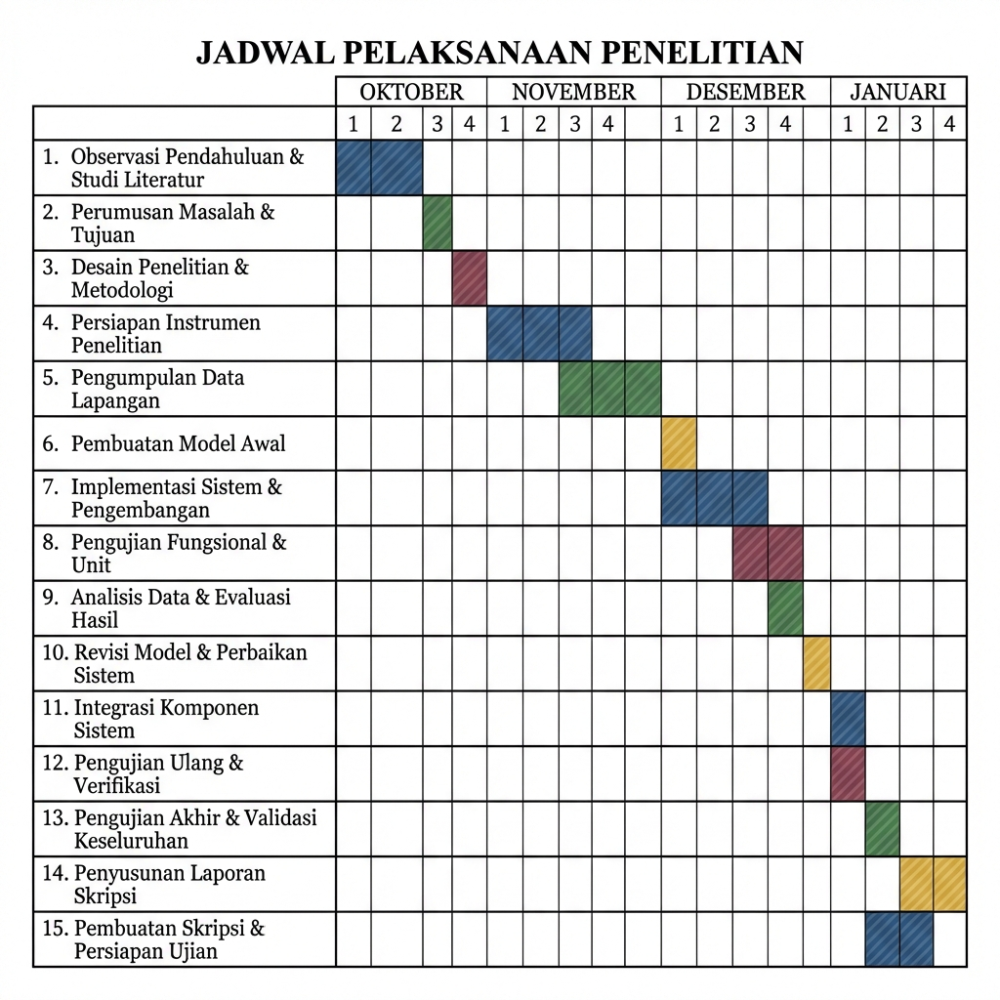

# BAB III: METODOLOGI PENELITIAN

## A. Gambaran Umum Penelitian

Penelitian ini dilaksanakan di Kantor Unit Penyelenggara Bandar Udara (UPBU) Kelas II Karel Sadsuitubun Langgur, khususnya pada Unit Elektronika Bandara (ELBAN). Bandara Karel Sadsuitubun merupakan gerbang transportasi udara bagi wilayah Indonesia bagian timur di Pulau Kei Kecil, Kabupaten Maluku Tenggara yang menuntut standar keselamatan dan keamanan penerbangan. Di balik operasional tersebut, Unit ELBAN memegang peranan dalam memastikan seluruh peralatan fasilitas keamanan penerbangan berfungsi dengan optimal selama jam operasional penerbangan.

Saat ini, kondisi pengelolaan administrasi dan teknis di Unit ELBAN masih bergantung pada metode konvensional. Para teknisi mencatat laporan harian, riwayat kerusakan, dan pemeliharaan peralatan menggunakan buku besar atau formulir manual berbahan kertas. Pendataan aset memang sebagian sudah tersimpan dalam format digital sederhana seperti Microsoft Excel, namun belum terintegrasi dengan laporan operasional harian. Kondisi ini menciptakan tantangan di lapangan: risiko kehilangan data akibat kerusakan fisik buku catatan, kesulitan dalam menelusuri riwayat kerusakan alat, serta lambatnya penyajian informasi status peralatan kepada pimpinan. Ketika terjadi gangguan mendadak, teknisi harus mencari dokumen manual terlebih dahulu sebelum melakukan penanganan masalah.

Kondisi yang diharapkan melalui penelitian ini adalah terjadinya transformasi digital pada lingkungan kerja Unit ELBAN. Sistem SIMA-ELBAN dikembangkan untuk mengintegrasikan pendataan peralatan fasilitas keamanan penerbangan berbasis QR Code, pencatatan riwayat pemeliharaan, pengaturan jadwal dinas personel, serta pengelolaan arsip digital dan layanan pengaduan ke dalam satu platform berbasis web. Dalam kondisi yang dirancang ini, teknisi menggunakan perangkat seluler untuk memindai QR Code pada peralatan guna mengakses atau memperbarui data peralatan. Selain itu, Pimpinan unit juga dapat memantau status peralatan dan kinerja personel melalui dashboard digital yang diperbarui secara real-time. Perubahan ini ditujukan untuk mendukung transparansi data, kecepatan koordinasi, dan akurasi pelaporan dalam menjaga keselamatan dan keamanan penerbangan di Bandara Karel Sadsuitubun Langgur.

## B. Jenis dan Pendekatan Penelitian

Penelitian ini menggunakan jenis penelitian *Research and Development* (R&D) yang berorientasi pada pengembangan dan menghasilkan produk berupa Sistem Informasi Manajemen Unit Elektronika Bandara (SIMA-ELBAN) berbasis web. Pendekatan R&D dipilih karena penelitian tidak hanya mengkaji permasalahan yang terjadi pada objek penelitian, tetapi juga mencakup proses perancangan, implementasi, evaluasi, perbaikan, dan pengujian sistem hingga sistem siap digunakan.

Dalam buku Judijanto dkk. (2024) yang berjudul Metodologi *Research and Development*, *Research and Development* (R&D) adalah proses atau langkah-langkah yang dilakukan untuk mengembangkan produk baru atau menyempurnakan produk yang sudah ada. Dalam konteks ini, Tujuan utama penelitian adalah mengembangkan SIMA-ELBAN untuk memperbaiki cara kerja manajemen di Unit Elektronika Bandara. Melalui tahap desain dan pengujian yang terencana, sistem ini dibuat bukan sekadar supaya terlihat baru, tapi benar-benar untuk menyelesaikan masalah operasional yang sering terjadi di lapangan.

Beberapa tahapan R&D dalam buku Judijanto dkk. (2024) meliputi beberapa langkah kritis dalam proses R&D, yaitu:

1.  **Penelitian dan Pengumpulan Informasi**: Melakukan studi literatur dan pengumpulan data untuk memahami masalah yang ada di lapangan serta kebutuhan yang perlu dipenuhi.
2.  **Perencanaan**: Menyusun rencana matang atau desain awal produk berdasarkan informasi dan data yang telah dikumpulkan pada tahap sebelumnya.
3.  **Pengembangan Prototipe Awal**: Pembuatan model fisik atau draf awal (prototipe) dari produk atau solusi yang diusulkan sebagai wujud nyata dari desain.
4.  **Pengujian Awal**: Melakukan uji coba lapangan dalam skala terbatas untuk menilai efektivitas, fungsionalitas, dan kelayakan prototipe tersebut.
5.  **Revisi Produk**: Mengadakan perbaikan dan penyempurnaan produk berdasarkan masukan (*feedback*) serta temuan yang didapat selama pengujian awal.
6.  **Uji Cobaa Lapangan Utama**: Implementasi produk dalam skala yang lebih luas untuk memverifikasi performa dan keandalannya sebelum diproduksi massal.
7.  **Revisi Operasional**: Melakukan penyempurnaan akhir terhadap produk atau solusi guna memastikan semuanya siap sebelum diluncurkan secara resmi.
8.  **Disseminasi dan Implementasi**: Menyebarluaskan produk atau solusi yang telah tervalidasi ke masyarakat luas untuk digunakan secara praktis.

Tetapi dalam penelitian ini, tahapan yang peneliti lakukan dibatasi hanya sampai pada tahap ke-7 (Revisi Operasional). Pembatasan ini dilakukan karena fokus utama penelitian adalah untuk menghasilkan produk yang siap digunakan secara fungsional di lingkungan internal Unit Elektronika Bandara, sehingga tahap diseminasi massal tidak dilakukan.

Model pengembangan sistem yang digunakan adalah *Prototyping* (*evolutionary prototyping*). Menurut Raymond McLeod, Jr. dan George P. Schell (dalam Pandiya dkk., 2023), *evolutionary prototype* yaitu prototype yang secara terus-menerus dikembangkan hingga prototype tersebut memenuhi fungsi dan prosedur yang dibutuhkan oleh sistem. Model ini sesuai digunakan karena kebutuhan sistem manajemen di lingkungan Unit ELBAN dapat berkembang seiring proses uji coba dan masukan langsung dari para teknisi di lapangan selama proses pengembangan berlangsung.

## C. Waktu dan Tempat Penelitian

### 1. Waktu Penelitian
Penelitian ini dilaksanakan dalam kurun waktu 4 (empat) bulan, terhitung mulai bulan Oktober hingga bulan Januari. Pelaksanaan penelitian disesuaikan dengan tahapan pengembangan sistem menggunakan metode *Research and Development* (R&D) dengan model *Evolutionary Prototyping*, yang bersifat iteratif dan bertahap. Adapun rincian jadwal pelaksanaan penelitian dapat dilihat pada tabel berikut:

*Gambar 3.1: Jadwal Pelaksanaan Penelitian (Time Table)*

Adapun rincian kegiatan penelitian pada setiap bulan dijelaskan sebagai berikut:

*   **Bulan Oktober**: Fase pengumpulan data dan identifikasi kebutuhan sistem. Aktivitas meliputi observasi lapangan kondisi eksisting Unit ELBAN, studi dokumentasi arsip administrasi unit, studi pustaka landasan teoretis, serta identifikasi kebutuhan sistem SIMA-ELBAN.
*   **Bulan November**: Fase *design and development*. Kegiatan mencakup perancangan dan pembuatan basis data sistem, pengembangan antarmuka pengguna (*frontend*), pengembangan sisi server (*backend*), serta proses *deployment* sistem ke lingkungan operasional web.
*   **Bulan Desember**: Fase *user validation* dan iterasi sistem. Aktivitas meliputi evaluasi sistem oleh teknisi dan Kanit ELBAN, analisis umpan balik (*feedback*) pengguna, perbaikan sistem berdasarkan hasil evaluasi, serta pengujian ulang (validasi iterasi).
*   **Bulan Januari**: Fase akhir penelitian. Kegiatan mencakup pengujian akhir fungsional sistem, implementasi sistem SIMA-ELBAN di lingkungan Unit ELBAN, serta penyusunan dan penyelesaian laporan skripsi penelitian.

### 2. Tempat Penelitian
Penelitian dilaksanakan di Unit ELBAN UPBU Karel Sadsuitubun Langgur.

## D. Objek Penelitian

Objek dalam penelitian ini adalah proses pengelolaan aktivitas kerja pada Unit ELBAN yang mencakup pencatatan, pelaporan, dan pemantauan kegiatan yang saat ini belum terintegrasi dalam sebuah sistem. Untuk melakukan pengembangan sistem SIMA-ELBAN pada objek tersebut, peneliti menggunakan dukungan infrastruktur teknologi informasi yang terdiri dari perangkat keras dan perangkat lunak sebagai berikut:

### 1. Perangkat Keras (Hardware)
Perangkat keras merupakan sarana fisik yang digunakan oleh peneliti untuk membangun sistem dan melakukan pengujian fungsionalitas secara langsung di lapangan.

| No | Perangkat Keras | Jumlah | Fungsi dalam Sistem |
| :--- | :--- | :--- | :--- |
| 1 | Laptop Pribadi | 1 Unit | Workstation Utama: Sebagai terminal untuk mengakses IDE Cloud dan mengelola logika program (backend & frontend). |
| 2 | Smartphone Pribadi | 1 Unit | Testing Device: Berfungsi sebagai klien (end-user) untuk menguji responsivitas tampilan web dan fitur mobile. |

### 2. Perangkat Lunak (Software)
Perangkat lunak berperan sebagai lingkungan kerja digital (*tech-stack*) yang digunakan untuk mentransformasi proses kerja manual Unit ELBAN ke dalam modul-modul sistem berbasis web.

| No | Perangkat Lunak | Fungsi dalam Sistem |
| :--- | :--- | :--- |
| 1 | Google Antigravity | Development Environment: Tempat menulis, menyusun, dan melakukan debugging seluruh kode program. |
| 2 | Next.js & React.js | Application Logic: Penempatan logika sistem (Routing, API, dan State Management) pada 11 modul utama. |
| 3 | Tailwind CSS | User Interface (UI) Layer: Penempatan desain visual dan tata letak agar sistem nyaman digunakan di berbagai ukuran layar. |
| 4 | Supabase | Data & Security Layer: Bertindak sebagai Database (PostgreSQL), Cloud Storage (File 5MB), dan sistem keamanan login. |
| 5 | GitHub | Bridge/Version Control: Sebagai jembatan penyimpanan kode antara lingkungan pengembangan (IDX) dengan platform hosting. |
| 6 | Vercel | Deployment/Production Server: Penempatan aplikasi secara publik agar bisa diakses oleh seluruh personel Unit ELBAN melalui internet. |
| 7 | Web Browser Brave | Client Interface: Gerbang utama bagi Admin dan Personel untuk berinteraksi dengan sistem (input dan output data). |

Produk yang dikembangkan dalam penelitian ini adalah SIMA-ELBAN berbasis web, yang menyediakan halaman/modul utama sebagai berikut:
1. Register
2. Login
3. Dashboard
4. Peralatan
5. Log Peralatan
6. Personel
7. Tugas
8. Jadwal
9. File
10. Konfirmasi Akun
11. Pengaduan

Sistem dapat diakses melalui laptop/PC maupun perangkat mobile (HP) selama terhubung dengan internet.

## E. Subjek Penelitian dan Peran Pengguna Sistem

Subjek yang terlibat dalam penggunaan dan evaluasi sistem meliputi pihak yang terkait dengan aktivitas Unit ELBAN, yaitu:
1. Teknisi ELBAN;
2. Kanit ELBAN;
3. Pihak/Unit lain (sebagai pelapor/pengguna tertentu), seperti: Kepala Bandara, Kasubag TU, Kepala Seksi TOKPD, Kepala Seksi Jasa, Unit Banglan, Unit Listrik, Unit Humas, Unit Admin, Unit A2B, Unit PK, Unit AVSEC, Unit Informasi, dan Unit Tata Terminal.

Dalam implementasi sistem, hak akses disederhanakan menjadi 3 kategori peran:
*   **Teknisi ELBAN**: dapat mengakses seluruh menu, namun terdapat fitur tertentu (misalnya fungsi tambah/kelola tertentu) yang dibatasi dan hanya tersedia pada peran Kanit.
*   **Kanit ELBAN**: memiliki akses penuh terhadap menu dan fitur pengelolaan, termasuk fitur yang tidak dapat diakses teknisi.
*   **Unit/Peran selain Teknisi dan Kanit**: akses dibatasi hanya pada halaman Pengaduan untuk pelaporan/permintaan terkait Unit ELBAN.

Perbedaan hak akses tersebut juga memengaruhi tampilan (UI) dan menu yang tersedia pada masing-masing peran.

## F. Teknik Pengumpulan Data

Teknik pengumpulan data dalam penelitian ini meliputi:

1.  **Observasi**: Observasi dilakukan untuk memahami alur kerja dan kebutuhan nyata di Unit ELBAN, seperti:
    *   proses pencatatan data peralatan,
    *   pelaporan log peralatan,
    *   penugasan dan penjadwalan kegiatan,
    *   mekanisme pengaduan dari unit lain.
2.  **Studi Dokumentasi**: Studi dokumentasi dilakukan dengan menelaah dokumen pendukung, terutama:
    *   format laporan/rekap yang digunakan,
    *   dokumen pendataan yang relevan,
    *   contoh catatan kegiatan perawatan,
    *   kebutuhan pelaporan yang mengacu pada ketentuan/regulasi internal.
3.  **Evaluasi Pengguna Saat Uji Coba Prototype**: Penelitian ini tidak menggunakan wawancara formal, namun mengganti proses tersebut dengan diskusi/masukan langsung dari pengguna ketika sistem diuji coba. Masukan pengguna digunakan sebagai dasar perbaikan dalam iterasi *prototyping*.

## G. Metode Pengembangan Sistem

Metode pengembangan sistem menggunakan *Prototyping* (*evolutionary prototyping*) dengan tahapan sebagai berikut:

1.  **Pengumpulan Kebutuhan Awal Sistem**: Pada tahap ini dilakukan identifikasi kebutuhan awal sistem berdasarkan observasi dan studi dokumentasi. Output tahap ini berupa daftar kebutuhan fungsional dan nonfungsional awal.
    *   **Kebutuhan fungsional utama**: autentikasi pengguna (register/login), manajemen data peralatan, pencatatan log peralatan, pengelolaan personel, pengelolaan tugas dan jadwal, pengelolaan file/dokumen, konfirmasi akun, dan pengaduan dari unit lain.
    *   **Kebutuhan nonfungsional utama**: sistem dapat diakses via PC dan HP, berbasis web dan membutuhkan koneksi internet, keamanan akses menggunakan akun dan role, data tersimpan terpusat pada basis data online.
2.  **Implementasi/Pembuatan Sistem**: Pada tahap ini prototype diimplementasikan menjadi sistem yang dapat dijalankan menggunakan teknologi: Next.js + React (frontend), Tailwind CSS (UI), Supabase (database & backend), GitHub (version control), dan Vercel (deployment).
3.  **Evaluasi dan Umpan Balik Pengguna**: Prototype yang telah berjalan diuji coba oleh pengguna (Teknisi ELBAN, Kanit ELBAN, dan minimal beberapa perwakilan unit lain). Evaluasi dilakukan melalui masukan langsung untuk melihat kesesuaian fitur, kelengkapan data, alur kerja, dan kemudahan tampilan.
4.  **Perbaikan dan Iterasi Sistem**: Perbaikan dilakukan berdasarkan hasil evaluasi pengguna. Proses iterasi bersifat berulang dan berhenti ketika pengguna menyatakan sistem sudah sesuai dan tidak ada masukan/perbaikan signifikan.
5.  **Pengujian Fungsional Sistem (Black Box Testing)**: Pada tahap ini dilakukan pengujian fungsional untuk memastikan seluruh halaman dan fitur bekerja sesuai harapan, berfokus pada input-output tanpa melihat kode program.

## H. Perancangan Sistem

Bagian ini menjelaskan rancangan sistem dari sisi arsitektur, basis data, dan antarmuka.

### 1. Perancangan Arsitektur Sistem
SIMA-ELBAN merupakan sistem berbasis web dengan arsitektur umum sebagai berikut:
*   Pengguna (User) mengakses sistem menggunakan browser di PC atau HP.
*   Aplikasi Web (Next.js/React.js/tailwind.css) memproses input pengguna, menjalankan logika aplikasi, serta menampilkan UI berdasarkan *role*.
*   Supabase (Database Online) menyimpan seluruh data sistem (akun, peralatan, log, tugas, jadwal, file, pengaduan, personel).
*   Deployment Online (Vercel) digunakan untuk publikasi sistem sehingga dapat diakses melalui internet.

**Alur sederhana**: User membuka web dan login -> Sistem memvalidasi akun & role -> Sistem menampilkan menu sesuai role -> Input data, diproses aplikasi, disimpan ke Supabase -> Data ditampilkan kembali pada dashboard atau halaman terkait.

### 2. Use Case Diagram
Use Case Diagram SIMA-ELBAN menunjukkan hubungan antara tiga aktor (Kanit ELBAN, Teknisi ELBAN, dan Unit Lain/Pelapor) dengan fitur-fitur di dalam sistem.
*   **Kanit ELBAN**: Memiliki hak akses paling lengkap (konfirmasi akun, dashboard, kelola peralatan, log, personel, tugas, jadwal, file, dan tindak lanjut pengaduan).
*   **Teknisi ELBAN**: Mengakses fitur operasional (dashboard, kelola peralatan, log, personel, tugas, jadwal, file, serta tindak lanjut pengaduan sesuai kebutuhan).
*   **Unit Lain/Pelapor**: Hanya memiliki akses untuk mendaftar/login dan mengirim pengaduan.

### 3. Perancangan Basis Data (ERD)
Perancangan basis data menggunakan *Entity Relationship Diagram* (ERD) untuk menggambarkan struktur logis dan hubungan antar entitas (peralatan, log_peralatan, tugas, pengaduan, akun, personel, jadwal, files). Struktur database dirancang di Supabase untuk mendukung manajemen aset dan pelaporan secara *real-time*.

## I. Teknik Evaluasi Prototype dan Dokumentasi Masukan

### 1. Teknik Evaluasi Prototype
Evaluasi prototype sistem SIMA Elban dilakukan menggunakan *User Acceptance Testing* (UAT) dengan pendekatan *Exploratory Testing*. Pengguna diberikan kebebasan penuh untuk mengeksplorasi prototype tanpa instruksi khusus dari peneliti. Peneliti berperan sebagai pengamat dan pencatat masukan terkait kendala, pendapat, dan saran perbaikan.

### 2. Dokumentasi Masukan Pengguna
Masukan dan saran didokumentasikan dalam bentuk tabel yang mencakup identitas pengguna, peran, masukan, saran, dan tindak lanjut peneliti. Dokumentasi ini digunakan sebagai dasar analisis untuk perbaikan prototipe.

Berikut adalah format tabel dokumentasi masukan pengguna:

| No | Nama Pengguna | Peran | Masukan Pengguna | Saran Pengguna | Tindak Lanjut Peneliti |
| :--- | :--- | :--- | :--- | :--- | :--- |
| | | | | | |

### 3. Analisis Tindak Lanjut
Masukan dianalisis untuk menentukan prioritas perbaikan berdasarkan kebutuhan sistem dan keterbatasan teknis guna meningkatkan kualitas prototipe.

## J. Teknik Pengujian Sistem

### 1. Tujuan Pengujian
Memastikan seluruh fungsi website berjalan sesuai spesifikasi dan mendeteksi kesalahan fungsional (*bug*) sebelum digunakan secara operasional agar sistem stabil dan andal.

### 2. Metode Pengujian Black Box
Pengujian dilakukan dengan fokus pada kesesuaian antara input dan output tanpa melihat struktur kode program. Pengujian dilakukan pada kondisi final untuk memastikan setiap fungsi berjalan sesuai kebutuhan.

Berikut adalah format tabel pengujian *black box*:

| No | Modul yang Diuji | Skenario Pengujian | Data Masukan | Hasil yang Diharapkan | Hasil Pengujian | Keterangan |
| :--- | :--- | :--- | :--- | :--- | :--- | :--- |
| | | | | | | |

### 3. Lingkungan Pengujian
*   **Perangkat Keras**: Laptop, tablet, atau smartphone dengan spesifikasi bebas.
*   **Perangkat Lunak**: Google Chrome, Mozilla Firefox, Brave, Opera, dan peramban lainnya.
*   **Jaringan**: Koneksi internet.

## K. Alur Penelitian

Urutan kegiatan penelitian adalah sebagai berikut:
1. Identifikasi masalah pada pengelolaan aktivitas Unit ELBAN.
2. Pengumpulan kebutuhan awal (observasi & dokumen).
3. Perancangan prototype (arsitektur, basis data, UI).
4. Implementasi/pembuatan sistem.
5. Uji coba prototype dan pengumpulan masukan pengguna.
6. Perbaikan/iterasi berdasarkan masukan.
7. Pengujian fungsional (*Black Box Testing*).
8. Penyusunan kesimpulan hasil pengembangan sistem.

## DAFTAR PUSTAKA BAB III

Judijanto, L., dkk. (2024). *Metodologi Research and Development (Teori dan Penerapan Metodologi RnD)*. Jambi: PT. Sonpedia Publishing Indonesia.

Pandiya, M. A., Sinaga, T. H., & Rahayu, E. (2023). Sistem Penjualan Akun dan Voucher Game Online dengan Metode Prototyping Evolusioner. *Jurnal Program Studi Sistem Informasi, Universitas Harapan Medan*.
